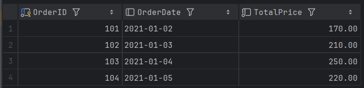
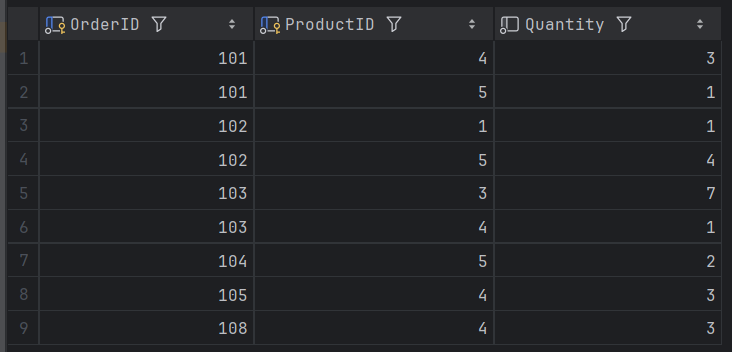
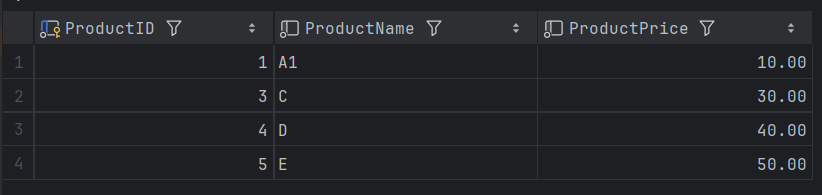

### 首先是我创建的3张表格,执行完Test.java后,数据库的3张表格

#### 订单的表格

#### 订单包含商品种类和数量的表格

#### 每件商品的具体信息的表格

 

### 接下来就是每个类的解释:

以下是 `JdbcUtil.java` 文件中各个函数的详细解释：

### 1. `startConnection()`

- **功能**: 建立与数据库的连接。
- **参数**: 无。
- **逻辑**:
  - 使用静态变量 `url`, `username`, `password` 创建数据库连接，并将其赋值给成员变量 `conn`。
  - 如果连接失败，抛出 `SQLException`。

### 2. `getConnection()`

- **功能**: 获取当前的数据库连接对象。
- **参数**: 无。
- **逻辑**:
  - 返回成员变量 `conn`，即当前的数据库连接对象。

### 3. `executeUpdate(String sql, Object... params)`

- **功能**: 执行 SQL 更新操作（如插入、更新、删除）。
- **参数**:
  - `String sql`: 要执行的 SQL 语句。
  - `Object... params`: 可变参数，用于设置 SQL 语句中的占位符。
- **逻辑**:
  - 创建一个 `PreparedStatement` 对象 `preStatementForUpdate`，并使用传入的 SQL 语句进行预编译。
  - 使用 `setObject` 方法为 SQL 语句中的每个占位符设置值。
  - 执行更新操作，返回受影响的行数。
  - 关闭 `PreparedStatement` 对象，释放资源。

### 4. `executeQuery(String sql, Object... params)`

- **功能**: 执行 SQL 查询操作，并返回查询结果。
- **参数**:
  - `String sql`: 要执行的 SQL 查询语句。
  - `Object... params`: 可变参数，用于设置 SQL 语句中的占位符。
- **逻辑**:
  - 查找第一个可用的索引 `useThis`，用于存储 `PreparedStatement` 和 `ResultSet`。
  - 创建一个 `PreparedStatement` 对象 `preStatementForQuery[useThis]`，并使用传入的 SQL 查询语句进行预编译。
  - 使用 `setObject` 方法为 SQL 语句中的每个占位符设置值。
  - 执行查询操作，并将结果存储在 `resultSet[useThis]` 中。
  - 返回 `ResultSet` 对象，供调用者处理查询结果。

### 5. `releaseSources()`

- **功能**: 释放所有已使用的数据库资源。
- **参数**: 无。
- **逻辑**:
  - 遍历 `resultSet` 和 `preStatementForQuery` 数组。
  - 如果某个 `ResultSet` 或 `PreparedStatement` 不为 `null`，则关闭它们，释放资源。
  - 这个方法通常在`Table.Crud`类中每次执行完数据库命令或事务回滚之后调用，确保资源及时释放，避免内存泄漏。

### 总结

`JdbcUtil` 类封装了与数据库交互的基本操作，包括建立连接、执行更新和查询操作以及释放资源。通过使用 `PreparedStatement` 和 `ResultSet` 数组，该类支持多个并发查询操作，并且提供了防止 SQL 注入的安全措施。

以下是 `ProductCrud.java` 文件中各个函数的详细解释：

### 1. `insertProduct(String ProductID, String ProductName, String ProductPrice)`

- **功能**: 向数据库 `product` 表中插入产品信息。
- **参数**:
  - `String ProductID`: 产品的唯一标识符。
  - `String ProductName`: 产品的名称。
  - `String ProductPrice`: 产品的价格。
- **逻辑**:
  - 检查价格和产品 ID 是否合法（必须大于 0）。
  - 检查是否已经存在相同的产品 ID，如果存在则插入失败。
  - 如果所有检查通过，则执行插入操作，并输出成功信息；否则输出失败信息。

### 2. `deleteProduct(String ProductID)`

- **功能**: 从数据库 `product` 表中删除指定的产品信息，并同时删除相关订单中的该产品信息。
- **参数**:
  - `String ProductID`: 要删除的产品的唯一标识符。
- **逻辑**:
  - 首先删除 `product` 表中的记录，如果找不到该产品则输出未找到信息。
  - 查找并删除 `OrderProduct` 表中与该产品相关的记录。
  - 如果某个订单中仅剩一个商品且被删除，则删除对应的 `Orders` 表中的记录。
  - 更新相关订单的总价。
  - 输出删除成功信息。

### 3. `updateProduct(String ProductID, String ProductNewName, String ProductNewPrice)`

- **功能**: 更新数据库 `product` 表中的产品信息，并更新相关订单的总价。
- **参数**:
  - `String ProductID`: 要更新的产品的唯一标识符。
  - `String ProductNewName`: 新的产品名称。
  - `String ProductNewPrice`: 新的产品价格。
- **逻辑**:
  - 检查新价格是否合法（必须大于 0）。
  - 更新 `product` 表中的记录，如果找不到该产品则输出未找到信息。
  - 查找并更新包含该产品的订单的总价。
  - 输出更新成功信息。

### 4. `queryProductByID(String ProductID)`

- **功能**: 根据产品 ID 查询数据库 `product` 表中的产品信息。
- **参数**:
  - `String ProductID`: 要查询的产品的唯一标识符。
- **逻辑**:
  - 执行查询操作，如果找到匹配的产品则打印其信息；否则输出未找到信息。

### 5. `queryProductByName(String ProductName, int matchRule)`

- **功能**: 根据产品名称查询数据库 `product` 表中的产品信息，支持模糊查询。
- **参数**:
  - `String ProductName`: 要查询的产品名称。
  - `int matchRule`: 匹配规则，0 表示完全匹配，1 表示模糊匹配。
- **逻辑**:
  - 根据匹配规则构建 SQL 查询语句。
  - 执行查询操作，如果找到匹配的产品则打印其信息；否则输出未找到信息。

### 6. `printProductInfo(ResultSet resultSet)`

- **功能**: 打印查询到的产品信息。
- **参数**:
  - `ResultSet resultSet`: 包含查询结果的 `ResultSet` 对象。
- **逻辑**:
  - 遍历 `ResultSet` 并将每个产品的信息拼接成字符串后打印；如果没有找到任何产品则输出未找到信息。

### 7. `checkProductExistOrRepeatedOrder(String OrderID, String... ProductIDAndQuantity)`

- **功能**: 检查订单 ID 是否重复以及产品 ID 是否存在，并验证数量合法性。
- **参数**:
  - `String OrderID`: 订单的唯一标识符。
  - `String... ProductIDAndQuantity`: 可变参数，格式为 `{ProductID1, Quantity1, ProductID2, Quantity2, ...}`。
- **逻辑**:
  - 检查是否存在重复的订单 ID。
  - 检查每个产品 ID 是否存在以及数量是否合法。
  - 如果有任何一项检查不通过，则输出错误信息并返回 1；否则返回 0。

### 8. `sortProductAndDisplay(int sortRule, int descOrAsc)`

- **功能**: 根据指定规则对产品进行排序并显示。
- **参数**:
  - `int sortRule`: 排序规则，1 表示按价格排序，2 表示按名称排序，0 表示不排序。
  - `int descOrAsc`: 排序顺序，1 表示降序，2 表示升序。
- **逻辑**:
  - 根据排序规则和顺序构建 SQL 查询语句。
  - 执行查询操作并遍历结果集，将每个产品的信息拼接成字符串后打印。

### 总结

`ProductCrud` 类封装了对 `product` 表的增删改查操作，包括插入、删除、更新、查询和排序。此外，它还处理了与订单表之间的关联操作，确保在修改或删除产品时，相关订单的信息也得到同步更新。

以下是 `OrdersCrud.java` 文件中各个函数的详细解释：

### 1. `insertOrder(String OrderID, String OrderDate, String... ProductIDAndQuantity)`

- **功能**: 向数据库 `Orders` 表中插入订单信息，并同时插入 `OrderProduct` 表，表示订单中包含的商品和商品数量。
- **参数**:
  - `String OrderID`: 订单的唯一标识符。
  - `String OrderDate`: 订单日期。
  - `String... ProductIDAndQuantity`: 可变参数，格式为 `{ProductID1, Quantity1, ProductID2, Quantity2, ...}`。
- **逻辑**:
  - 检查是否有重复的订单 ID、不存在的产品 ID 和不合法的商品数量。
  - 检查日期格式是否正确。
  - 如果所有检查通过，则先插入一条 `Orders` 记录（总价初始为 0），然后插入多条 `OrderProduct` 记录。
  - 最后更新订单的总价。

### 2. `deleteOrder(String OrderID)`

- **功能**: 从数据库 `Orders` 表中删除指定的订单信息，并同时删除 `OrderProduct` 表中的相关记录。
- **参数**:
  - `String OrderID`: 要删除的订单的唯一标识符。
- **逻辑**:
  - 删除 `Orders` 表中的记录。
  - 删除 `OrderProduct` 表中与该订单相关的记录。
  - 输出删除成功信息。

### 3. `updateOrder(String OrderID, String NewOrderDate, String... newProductIDAndQuantity)`

- **功能**: 更新数据库 `Orders` 表中的一条订单信息，包括订单日期和商品数量。
- **参数**:
  - `String OrderID`: 要更新的订单的唯一标识符。
  - `String NewOrderDate`: 新的订单日期。
  - `String... newProductIDAndQuantity`: 可变参数，格式为 `{newProductID1, newQuantity1, newProductID2, newQuantity2, ...}`。
- **逻辑**:
  - 检查要更新的订单是否存在。
  - 检查新的产品 ID 是否存在以及商品数量是否合法。
  - 检查新日期格式是否正确。
  - 如果所有检查通过，则删除 `OrderProduct` 表中与该订单相关的所有记录，再插入新的 `OrderProduct` 记录。
  - 更新 `Orders` 表中的订单日期和总价。
  - 输出更新成功信息。

### 4. `queryOrder(String OrderID)`

- **功能**: 从数据库 `Orders` 表中查询某个订单的基本信息（订单号、订单日期、总价）。
- **参数**:
  - `String OrderID`: 要查询的订单的唯一标识符。
- **逻辑**:
  - 执行查询操作，如果找到匹配的订单则返回其基本信息；否则返回 `null`。

### 5. `querySingleOrderID(String OrderID)`

- **功能**: 查询一个订单的所有信息，包括订单号、订单日期、总价和商品信息。
- **参数**:
  - `String OrderID`: 要查询的订单的唯一标识符。
- **逻辑**:
  - 调用 `queryOrder` 方法获取订单基本信息。
  - 如果找不到订单则输出未找到信息。
  - 否则调用 `OrderProductCrud.queryOrderProduct` 获取订单中的商品信息并一起打印。

### 6. `sortOrderAndDisplay(int sortRule, int descOrAsc)`

- **功能**: 根据指定规则对订单进行排序并显示。
- **参数**:
  - `int sortRule`: 排序规则，1 表示按总价排序，2 表示按下单时间排序，0 表示不排序。
  - `int descOrAsc`: 排序顺序，1 表示降序，2 表示升序。
- **逻辑**:
  - 根据排序规则和顺序构建 SQL 查询语句。
  - 执行查询操作并遍历结果集，将每个订单的信息拼接成字符串后打印，包括订单中的商品信息。

### 7. `updateOrdersTotalPrice(String OrderID)`

- **功能**: 更新指定订单的总价。
- **参数**:
  - `String OrderID`: 要更新的订单的唯一标识符。
- **逻辑**:
  - 使用 SQL 查询计算订单中所有商品的总价，并更新 `Orders` 表中的 `TotalPrice` 字段。

### 总结

`OrdersCrud` 类封装了对 `Orders` 表的增删改查操作，包括插入、删除、更新、查询和排序。此外，它还处理了与 `OrderProduct` 表之间的关联操作，确保在修改或删除订单时，相关商品的信息也得到同步更新。

以下是 `OrderProductCrud.java` 文件中各个函数的详细解释：

### 1. `insertOrderProduct(String OrderID, String ProductID, String Quantity)`

- **功能**: 向数据库 `OrderProduct` 表中插入一条记录，相当于向订单中添加一个商品。
- **参数**:
  - `String OrderID`: 订单的唯一标识符。
  - `String ProductID`: 商品的唯一标识符。
  - `String Quantity`: 商品的数量。
- **逻辑**:
  - 检查 `Orders` 表中是否存在该订单，如果不存在则输出错误信息并返回。
  - 检查 `Product` 表中是否存在该商品，如果不存在则输出错误信息并返回。
  - 检查该商品是否已经存在于订单中，如果存在则输出错误信息并返回。
  - 如果所有检查通过，则插入一条 `OrderProduct` 记录，并更新订单的总价。
  - 输出成功信息。

### 2. `deleteOrderProduct(String OrderID, String ProductID)`

- **功能**: 从数据库 `OrderProduct` 表中删除一条记录，相当于从订单中删除一个商品。
- **参数**:
  - `String OrderID`: 订单的唯一标识符。
  - `String ProductID`: 商品的唯一标识符。
- **逻辑**:
  - 删除 `OrderProduct` 表中的记录。
  - 检查订单中是否还有其他商品：
    - 如果没有其他商品，则删除 `Orders` 表中的记录。
    - 如果还有其他商品，则重新计算订单的总价。
  - 输出删除成功信息。

### 3. `deleteAllSameOrderID(String OrderID)`

- **功能**: 删除 `OrderProduct` 表中所有含有相同订单 ID 的记录，以便更好地进行订单更新。
- **参数**:
  - `String OrderID`: 要删除的订单的唯一标识符。
- **逻辑**:
  - 执行删除操作，删除 `OrderProduct` 表中所有与指定订单 ID 相关的记录。

### 4. `queryOrderProduct(String OrderID)`

- **功能**: 查询某个订单号的所有商品信息。
- **参数**:
  - `String OrderID`: 要查询的订单的唯一标识符。
- **逻辑**:
  - 使用 SQL 查询语句，连接 `OrderProduct` 和 `Product` 表，获取订单中所有商品的信息（包括商品 ID、名称和数量）。
  - 遍历查询结果集，将每个商品的信息拼接成字符串。
  - 返回拼接后的字符串，并重置 `StringBuilder`。

### 总结

`OrderProductCrud` 类封装了对 `OrderProduct` 表的增删改查操作，确保在修改或删除订单中的商品时，相关订单的信息也得到同步更新。具体操作包括：

- 插入商品到订单中。
- 删除订单中的商品。
- 删除订单中所有商品。
- 查询订单中的所有商品信息。

这些操作确保了订单和商品之间的关联关系在数据库中保持一致，并且在每次修改后及时更新订单的总价。

以下是 `TableCrud.java` 文件中各个函数的详细解释：

### 1. `CreateTable(String tableSql)`

- **功能**: 创建数据库表。
- **参数**:
  - `String tableSql`: 创建表的 SQL 语句。
- **逻辑**:
  - 设置事务自动提交为 `false`，开启事务。
  - 执行创建表的 SQL 语句。
  - 提交事务；如果发生异常，则回滚事务并抛出异常。

### 2. `InsertProduct(String ProductID, String ProductName, String ProductPrice)`

- **功能**: 插入产品数据到 `Product` 表。
- **参数**:
  - `String ProductID`: 产品的唯一标识符。
  - `String ProductName`: 产品的名称。
  - `String ProductPrice`: 产品的价格。
- **逻辑**:
  - 设置事务自动提交为 `false`，开启事务。
  - 调用 `ProductCrud.insertProduct` 方法插入产品数据。
  - 提交事务；如果发生异常，则回滚事务、释放资源并抛出异常。

### 3. `InsertOrder(String OrderID, String OrderDate, String... ProductIDAndQuantity)`

- **功能**: 插入订单数据到 `Orders` 和 `OrderProduct` 表。
- **参数**:
  - `String OrderID`: 订单的唯一标识符。
  - `String OrderDate`: 订单日期。
  - `String... ProductIDAndQuantity`: 可变参数，格式为 `{ProductID1, Quantity1, ProductID2, Quantity2, ...}`。
- **逻辑**:
  - 设置事务自动提交为 `false`，开启事务。
  - 调用 `OrdersCrud.insertOrder` 方法插入订单数据。
  - 提交事务；如果发生异常，则回滚事务、释放资源并抛出异常。

### 4. `InsertOrderProduct(String OrderID, String ProductID, String Quantity)`

- **功能**: 插入订单商品数据到 `OrderProduct` 表。
- **参数**:
  - `String OrderID`: 订单的唯一标识符。
  - `String ProductID`: 商品的唯一标识符。
  - `String Quantity`: 商品的数量。
- **逻辑**:
  - 设置事务自动提交为 `false`，开启事务。
  - 调用 `OrderProductCrud.insertOrderProduct` 方法插入订单商品数据。
  - 提交事务；如果发生异常，则回滚事务、释放资源并抛出异常。

### 5. `DeleteOrderProduct(String OrderID, String ProductID)`

- **功能**: 删除订单中的某个商品数据。
- **参数**:
  - `String OrderID`: 订单的唯一标识符。
  - `String ProductID`: 商品的唯一标识符。
- **逻辑**:
  - 设置事务自动提交为 `false`，开启事务。
  - 调用 `OrderProductCrud.deleteOrderProduct` 方法删除订单商品数据。
  - 提交事务；如果发生异常，则回滚事务、释放资源并抛出异常。

### 6. `DeleteOrder(String OrderID)`

- **功能**: 删除整个订单数据及其相关商品数据。
- **参数**:
  - `String OrderID`: 订单的唯一标识符。
- **逻辑**:
  - 设置事务自动提交为 `false`，开启事务。
  - 调用 `OrdersCrud.deleteOrder` 方法删除订单数据。
  - 提交事务；如果发生异常，则回滚事务、释放资源并抛出异常。

### 7. `DeleteProduct(String ProductID)`

- **功能**: 删除产品数据及其在订单中的相关商品数据，并更新订单总价。
- **参数**:
  - `String ProductID`: 商品的唯一标识符。
- **逻辑**:
  - 设置事务自动提交为 `false`，开启事务。
  - 调用 `ProductCrud.deleteProduct` 方法删除产品数据。
  - 提交事务；如果发生异常，则回滚事务、释放资源并抛出异常。

### 8. `QueryProductByID(String ProductID)`

- **功能**: 查询指定 ID 的产品信息。
- **参数**:
  - `String ProductID`: 产品的唯一标识符。
- **逻辑**:
  - 设置事务自动提交为 `false`，开启事务。
  - 调用 `ProductCrud.queryProductByID` 方法查询产品信息。
  - 提交事务；如果发生异常，则回滚事务、释放资源并抛出异常。

### 9. `QueryOrderByID(String OrderID)`

- **功能**: 查询指定 ID 的订单信息及其包含的商品信息。
- **参数**:
  - `String OrderID`: 订单的唯一标识符。
- **逻辑**:
  - 设置事务自动提交为 `false`，开启事务。
  - 调用 `OrdersCrud.querySingleOrderID` 方法查询订单信息。
  - 提交事务；如果发生异常，则回滚事务、释放资源并抛出异常。

### 10. `SortProductAndDisplay(int sortRule, int descOrAsc)`

- **功能**: 对产品进行排序并显示结果。
- **参数**:
  - `int sortRule`: 排序规则，1 表示按价格排序，2 表示按名称排序，0 表示不排序。
  - `int descOrAsc`: 排序顺序，1 表示降序，2 表示升序。
- **逻辑**:
  - 设置事务自动提交为 `false`，开启事务。
  - 调用 `ProductCrud.sortProductAndDisplay` 方法对产品进行排序并显示。
  - 提交事务；如果发生异常，则回滚事务、释放资源并抛出异常。

### 11. `SortOrderAndDisplay(int sortRule, int descOrAsc)`

- **功能**: 对订单进行排序并显示结果。
- **参数**:
  - `int sortRule`: 排序规则，1 表示按总价排序，2 表示按下单时间排序。
  - `int descOrAsc`: 排序顺序，1 表示降序，2 表示升序。
- **逻辑**:
  - 设置事务自动提交为 `false`，开启事务。
  - 调用 `OrdersCrud.sortOrderAndDisplay` 方法对订单进行排序并显示。
  - 提交事务；如果发生异常，则回滚事务、释放资源并抛出异常。

### 12. `UpdateProduct(String ProductID, String ProductNewName, String ProductNewPrice)`

- **功能**: 更新产品数据。
- **参数**:
  - `String ProductID`: 产品的唯一标识符。
  - `String ProductNewName`: 新的产品名称。
  - `String ProductNewPrice`: 新的产品价格。
- **逻辑**:
  - 设置事务自动提交为 `false`，开启事务。
  - 调用 `ProductCrud.updateProduct` 方法更新产品数据。
  - 提交事务；如果发生异常，则回滚事务、释放资源并抛出异常。

### 13. `UpdateOrder(String OrderID, String NewOrderDate, String... newProductIDAndQuantity)`

- **功能**: 更新订单数据及其包含的商品数据。
- **参数**:
  - `String OrderID`: 订单的唯一标识符。
  - `String NewOrderDate`: 新的订单日期。
  - `String... newProductIDAndQuantity`: 可变参数，格式为 `{newProductID1, newQuantity1, newProductID2, newQuantity2, ...}`。
- **逻辑**:
  - 设置事务自动提交为 `false`，开启事务。
  - 调用 `OrdersCrud.updateOrder` 方法更新订单数据。
  - 提交事务；如果发生异常，则回滚事务、释放资源并抛出异常。

### 14. `QueryProductByName(String ProductName, int matchRule)`

- **功能**: 根据产品名称查询产品数据，支持模糊查询。
- **参数**:
  - `String ProductName`: 产品的名称。
  - `int matchRule`: 匹配规则，0 表示完全匹配，1 表示模糊匹配。
- **逻辑**:
  - 设置事务自动提交为 `false`，开启事务。
  - 调用 `ProductCrud.queryProductByName` 方法查询产品数据。
  - 提交事务；如果发生异常，则回滚事务、释放资源并抛出异常。

### 总结

`TableCrud` 类封装了对 `Orders`、`Product` 和 `OrderProduct` 表的各种操作（如创建、插入、删除、更新、查询和排序），并且每个方法都包含了事务处理，以确保数据的一致性。通过设置事务自动提交为 `false`，并在操作完成后提交或回滚事务，保证了所有操作要么全部成功，要么全部失败，从而避免了部分操作成功导致的数据不一致问题。

以下是 `CheckDateFormat.java` 文件中函数的详细解释：

### `isValidDate(String date)`

- **功能**: 检查给定的日期字符串格式是否正确。
- **参数**:
  - `String date`: 要检查的日期字符串，格式应为 `"yyyy-MM-dd"`（例如：`"2023-10-05"`）。
- **逻辑**:
  - 创建一个 `DateTimeFormatter` 对象，指定日期格式为 `"yyyy-MM-dd"`。
  - 尝试使用该格式化器解析传入的日期字符串：
    - 如果解析成功（即日期字符串符合指定格式且是有效的日期），则返回 `true`。
    - 如果解析失败（即日期字符串不符合指定格式或不是有效的日期），捕获 `DateTimeParseException` 异常并返回 `false`。

这个方法可以确保在插入或更新包含日期字段的数据时，日期格式是正确的，从而避免因无效日期格式导致的错误。